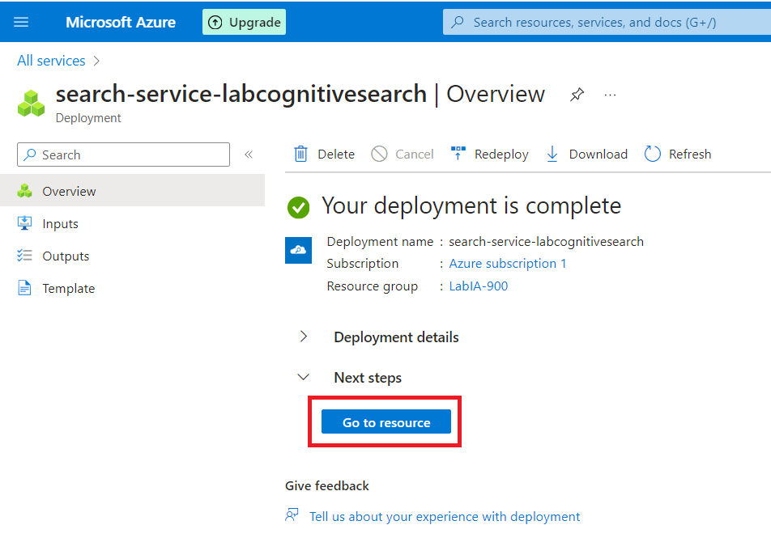

# MS_Azure_AI900_DIO_Azure_Cognitive_Search
 _Projeto realizado para a Certificação IA900 oferecida pela Microsoft em parceria com a DIO - Digital Innovation One_

---
## O Azure Cognitive Search

O _Azure Cognitive Search_ ou _Azure AI Search_ é uma ferramenta que compõe o conjunto de serviços de AI e Machine Learning do Azure. Ele não é apenas uma ferramenta de pesquisa, mas oferece recuperação segura de informações em escala, como catálogos e/ou documentos em bancos de dados, através de vetores e indexadores. Além disso, o _Azure AI Search_ integra-se com outros serviços do Azure.

---
## Criando um _Resource_ do _AI Search_
---
Na pagina inicial do Azure, clique em _Create a resource_. 

Na nova página, no canto esquerdo clique em _AI + MAchine Learning_ e selecione o _AI Search_.

Em seguida, clique em _Create_ no canto superior esquerdo. 

O Azure solicita que você preencha alguns dados, como o _Subscription_,  _Resource group_, _Region_. Em _Princint tier_, clique em _Change Pricing Tier_.

Selecione o _Basic_.

Dê um nome ao seu _service name_ (no meu exemplo, 'labcognitivesearch') E não esqueça de marcar a _checkbox_, onde você concorda com os termos do Azure AI Services. Por fim, clique em _Review + create_.

Por fim, clique em _Create_.

Aguarde aparecer a mensagem _Your deployment is complete_. Quando ele estiver concluído, vá em _Go to resource_.

Pronto! Seu _resource_ está criado, agora vá na barra superior do canto esquerdo e clique em _Home_, pois é necessário criar outro _resource_.

---
## Criando um _Resource_ do _AI Services_
---
Para construir nossa ferramenta de pesquisa, além do recurso do _AI Search_, por isso é necessário criar um recurso no _AI Services_, já que a ferramenta de pesquisa deve se basear em serviço de AI, como por exemplo, busca de padrões em imagens(utilza-se o _Vision_), ou ler e compreender textos (utilza-se o _Leitor Imersivo_), ou que detecte e identifique pessoas e emoções em imagens (utilza-se o _Face_), entre outros.

Na nova página, no canto esquerdo clique em _AI + MAchine Learning_ e selecione o _Azure AI Services_.

O Azure solicita que você preencha alguns dados, como o _Subscription_,  _Resource group_, _Region_. Além disso, você criar um nome para seu recurso (no meu exemplo, _LabPesquisaIA_).

Em _Princint tier_, selecione o _Standard SO_. E não esqueça de marcar a _checkbox_, onde você concorda com os termos do Azure AI Services. Por fim, clique em _Review + create_.

Clique em _Create_ e aguarde.

Aguarde aparecer a mensagem _Your deployment is complete_.

---
## Criando uma Conta para Armazenamento e configurando-a 
---

Voltamos novamente para a página inicial do Azure, através de _Home_. Agora é necessário criar e configurar uma _Storage Accounts_ para armazenar os documentos e/ou banco de dados que serão a base da pesquisa.

Na pagina inicial, clique em _Storage Accounts_.

Clique em _Create_.

O Azure solicita que você preencha alguns dados, como o _Subscription_,  _Resource group_, _Region_. Além disso, você criar um nome para o _Storage account name_ (no meu exemplo, _iapesquisacognitive_). 

Em _Redundancy_, selecione o _LRS - Locally-redundant storage_.

Clique em _Review + create_ e por fim em _Create_.

Aguarde aparecer a mensagem _Your deployment is complete_. Após isso, clique em _Go to resource_.

Agora, vamos configurar nosso recurso.

No menu lateral esquerdo, na aba _Settings_, clique em _Configuration_.

Na opção _Allow Blob anonymous access_ e clique em _Enabled_.Depois clique em _Save_.

---
## Upload dos arquivos
---

No menu lateral esquerdo, na aba _Data storage_, clique em _Containers_.

Clique em _+ Container_ para criar um novo.

Crie um nome para seu _container_ (como regra, o nome deve ter todas as letras minúsculas, sem caracteres especiais e sem espaços). Em _Anonymous access level_ escolha _read access for containers and blobs_ (para liberar essa opção, a ação interior de permitir ao _Blob_ acesso é necessária). Por fim, cliqye em _Create_.

Voltando para a página inicial dos _Containers_, veja se o _container_ criado aparece. Clique nele.

Vá em _Upload_.

Selecione os documentos ou base de dados para a pesquisa.

---
## Configurando a pesquisa da 32 a 53
---

Volte para a _home_.

Acesse o _Azure AI services_ e selecione o recurso criado (no meu exemplo é _labcognitivesearch_).

Selecione o _Import data_.

Os documentos estão na conta criada no _Blob Storage_, então selecionamos o _Azure Blob Storage_.

Uma guia lateral é aberta, com as opções de _Containers_, escolhemos o que queremos utilizar na pesquisa (no meu exemplo é _coffeereviews_).

O momento de importar é o momento de indexação dos dados, mas antes é necessário informar o _Data Source_, o _Data Source name_, quais dados serão extraídos (_Content and metadata_), _Parsing Mode_ (é recomendável o _default_), além da _Subscription_ e em _Connection string_, selecionamos a _storage account_ e o container _coffee-reviews_.

Agora, vamos 'enriquecer' nossa ferramenta de pesquisa com os dados. Então crio um nome para o _skillset_ (no meu exemplo, coffee-slillset) e ativamos o serviço de AI _OCR_ (Optical Character Recognition) que utilizaremos. Além disso, em Ensure that the _Source data field_ selecione _merged content_ e em _Enrichment granularity level_ selecione _Pages (5000 character chunks)_.

Escolhemos os parâmetros de nossa ferramenta de pesquisa. Temos que selecionar quais _Text Cognitive Skills_ iremos utilizar em coluna.

É necessário conectar com a _Storage Account_. Selecione a _Storage Account_ criada anteirormente.

Acesse _container_ criado. 

Crie um novo _container_ para armazenar dados da pesquisa, com _Anonymous Access Level_ _Private_. Por fim, clique em _Create_.

Aqui configuramos o _container_ recém criado. O Azure irá buscar por páginas, _key phrases_, entidades, detalhes de imagens e referências.

Agora é o momento da indexação. Mude o somente o nome, em _Key_ mantenha o _metadata storage path_ e o _Suggester name_ em branco.

Faça uma revisão nos campos selecionados e marque a checkbox _filterable_ para todos os campos selecionados.

Dê um nome ao seu Index e selecione _Once_ em _Schedule_.

Expanda as opções avançadas e marque a checkbox _Base-64 Encode Keys_ para deixar a indexação mais eficiente. E por fim, clique em _Submit_. 

Após criar o data source, skillset, index e o  indexer. Voltamos para a página inicial do _Azure AI Search_. No menu lateral, dentro de _Search Management_, selecione _Indexers_.

Selecione o _indexer_ recém-criado e depois _&orarr;_. Aguarde até receber a mensagem de sucesso e selecione o indexer.

Dentro do indexer, selecione _Search explorer_.

Dentro do _Search explorer_ é onde escrevemos as _queries_, para fazer a pesquisa e é também onde vemos os resultados em JSON.

No exemplo abaixo, foi adicionado dois parâmetros: "sentiment: 'positive'"  e "count": true. Então o _AI Search_ retorna os feedbacks com avaliações positivas.

***
## Conclusões

O Azure AI Search mostra-se uma ferramenta completa para quem deseja fazer pesquisas pelo fato de ter a sua disposição todos os serviços de IA do Azure, criando a possibilidade de ter em um só local o banco de dados junto com a ferramenta de IA (seja reconhecimento de texto ou de imagem) junto com a ferramenta de pesquisa. Além de possuir os tutoriais, que auxiliam na construção do projeto, não exigindo do usuário um conhecimento profundo em Machine Learning.

----
## Fontes/Links Úteis
---
- **** Disponível em: https://learn.microsoft.com/pt-pt/azure/search/search-what-is-azure-search, Acesso em: 21 de Abril de 2024.
- **** Disponível em: https://microsoftlearning.github.io/mslearn-ai-fundamentals/Instructions/Labs/11-ai-search.html
, Acesso em: 21 de Abril de 2024.
- **** Disponível em: https://learn.microsoft.com/en-us/training/modules/analyze-receipts-form-recognizer/2-document-intelligence-capabilities, Acesso em: 21 de Abril de 2024.
- **** Disponível em: https://learn.microsoft.com/pt-pt/azure/search/search-create-service-portal, Acesso em: 21 de Abril de 2024.
